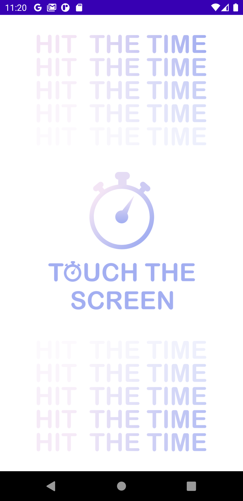
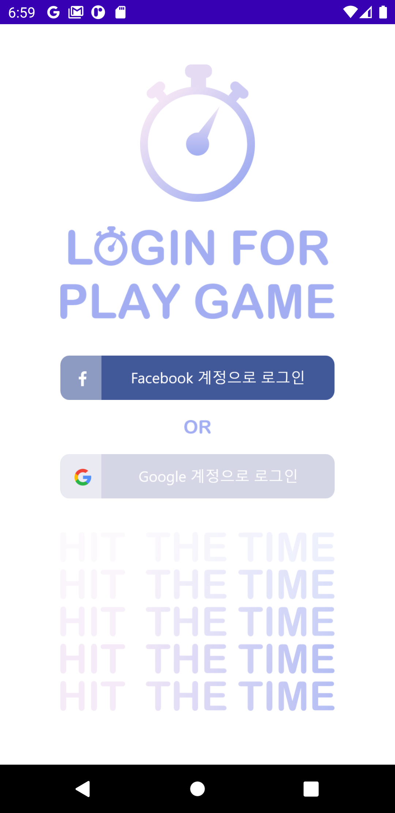
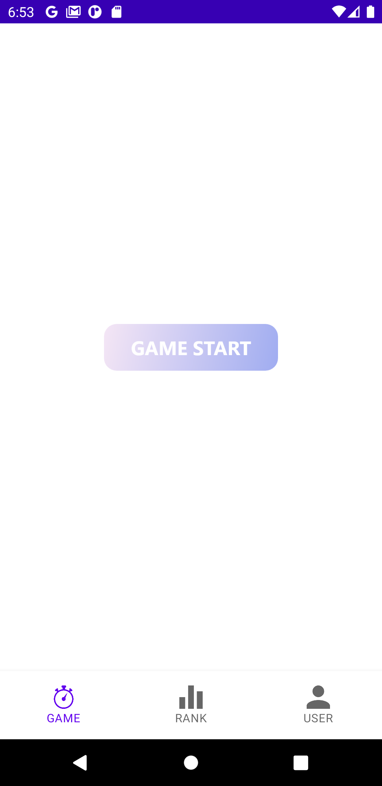
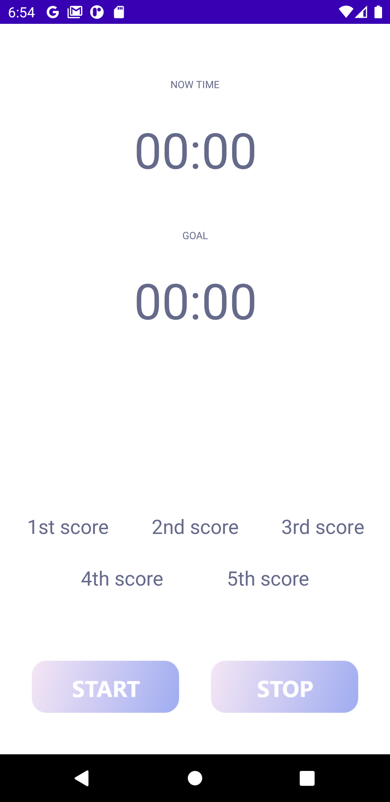
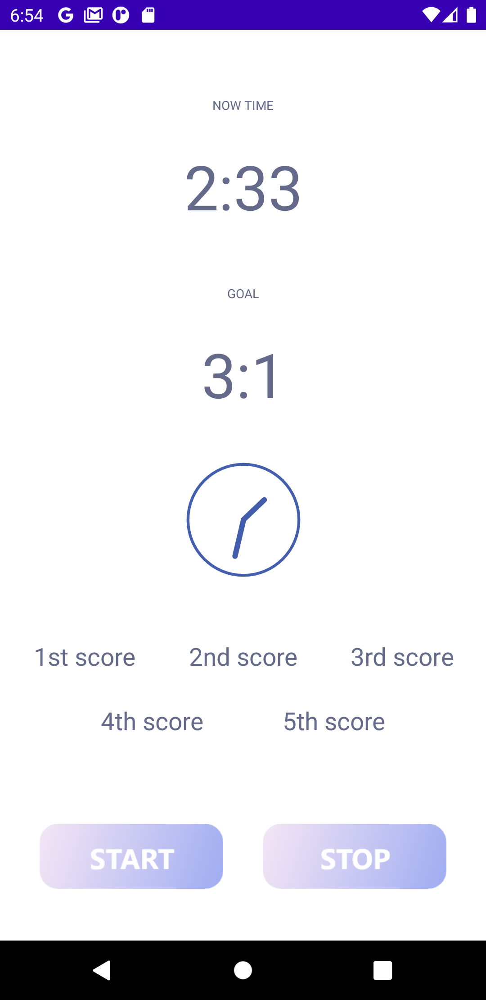
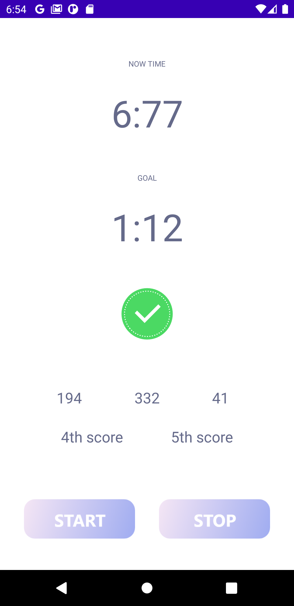
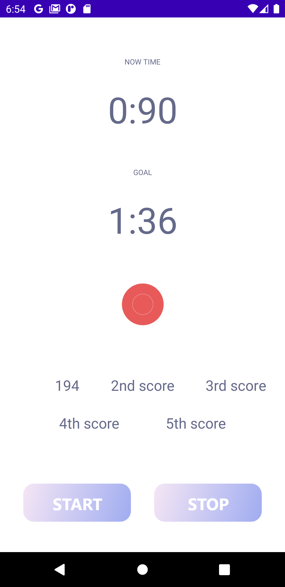
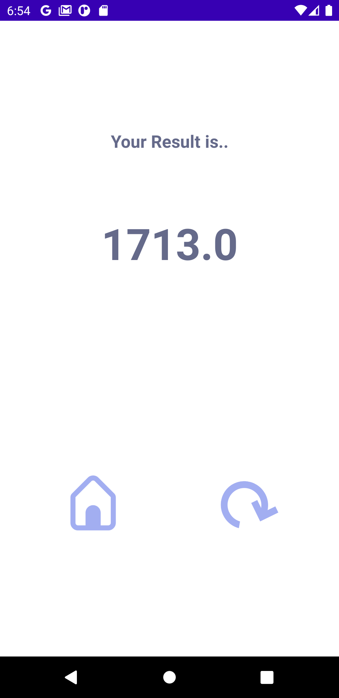
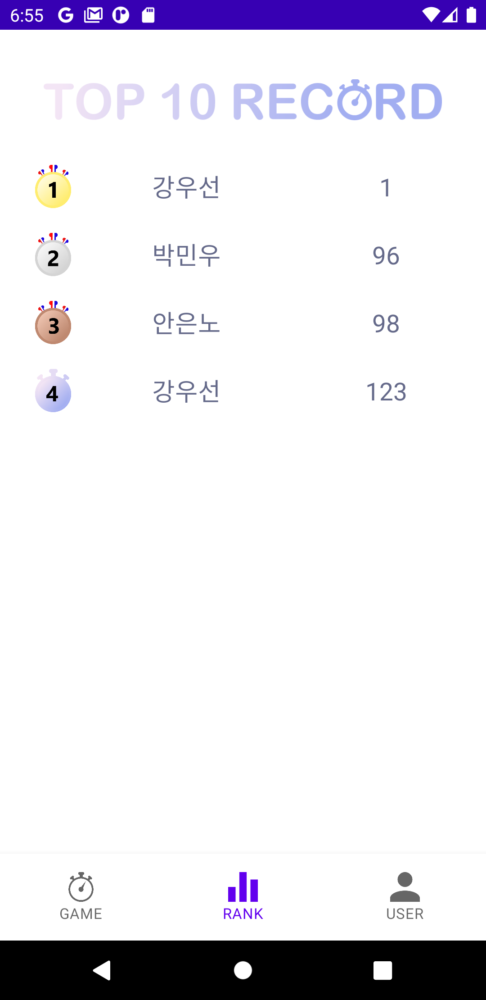
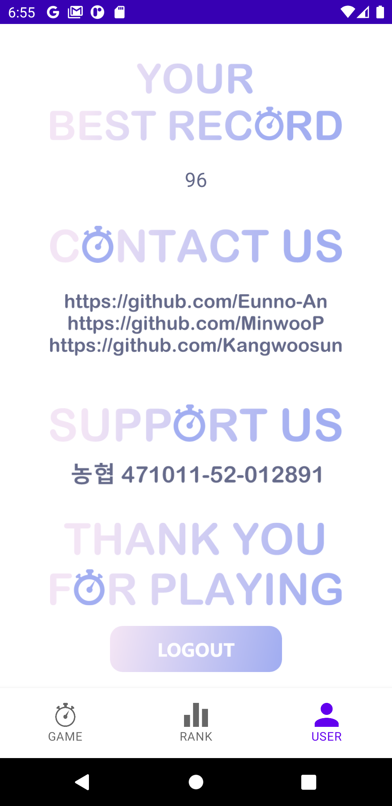

# HitTheTime ⏱

    

    

 

## 앱 소개

- 시간 맞추기 게임
- 스톱워치를 하듯이 랜덤으로 형성되는 시간을 5번의 기회에 걸쳐 맞춰 오차의 합이 가장 적은사람이 이기는 게임
- 현재 코로나로 인해 지루하고 무료한 일상 속, 시간을 보내기에 안성맞춤인 게임

 

## 사용기술

- Android(Java)
- Firebase
  - Auth
  - Database
- Adobe xd

 

## Team. MinWoosunNo 🧸

||||
|:-:|:-:|:-:|
|19-71001284 박민우|19-70000030 강우선|21-mipel 안은노|
| [@MinwooP](https://github.com/MinwooP) | [@Kangwoosun](https://github.com/Kangwoosun) | [@Eunno-An](https://github.com/Eunno-An)

 

 

## 역할분담

 - MinwooP : Ui
 - Kangwoosun : Login, DB
 - Eunno-An : PM, Timer

 

## MinwooP 🦄

- UI design
  - overall UI design using "Adobe xd"
  - design drawble resource icon and color to be used for App's ImageView, Button, Background.
  - adjust UI component's ratio according to resolution of each device
  - make App icon, screenshots, graphic images for app release

- Fragment design
  - switch screen among the fragments using BottomNavigationView
  - customize RecyclerView by implementing Recycleritem, RecyclerTextAdapter class

 

## Kangwoosun 🦊

- Login
  - FirebaseAuth
  - GoogleLogin
  - FacebookLogin (Facebook button)
  - AutoLogin(SharedPreferences)

- DB
  - Firebasedatabase, Referenece
  - database read (DataSnapshot) & write (FirebasePost, setValue)
  - data sort (Collection, Comparator)
  - Bundle (putParcelableArrayList ..)

 

## Eunno-An 🐼

**EMPTY**

 

## 개선할 점

 - 종종 타이머가 불규칙적으로 진행되는 사항 선
 - SNS, Email 로그인 추가
 - 게임진행중 효과음 추가
 - 게임 모드 추가, 상점기능 활성화, 친구추가 기능 구현

